# Flutter 版 WanAndroid 客户端

[![Flutter][1]][2]  [![Dart][3]][4]  [![Release][5]][6]  [![GitHub license][7]][8]  [![][9]][10] 

[1]:https://img.shields.io/badge/Flutter-1.7.8-5bc7f8.svg
[2]:https://flutter.dev

[3]:https://img.shields.io/badge/Dart-2.4.0%2B-00B4AB.svg
[4]:https://dart.dev

[5]:https://img.shields.io/github/release/iceCola7/flutter_wanandroid.svg
[6]:https://github.com/iceCola7/flutter_wanandroid/releases/latest

[7]:https://img.shields.io/badge/license-Apache%202-blue.svg
[8]:https://github.com/iceCola7/flutter_wanandroid/blob/master/LICENSE

[9]:https://img.shields.io/badge/QQ-563859095-orange.svg
[10]:http://wpa.qq.com/msgrd?v=3&uin=563859095&site=qq&menu=yes

## 前言

> 项目是继 [Kotlin版玩Android](https://github.com/iceCola7/WanAndroid) 之后的又一款 [玩Android] APP ，其主要功能以及界面UI风格和 [Kotlin版玩Android](https://github.com/iceCola7/WanAndroid) 基本相同，不过也有一些不一样。 

> 在学习 `Flutter` 的过程中，收集了一些很好的学习网站以及插件，并做了汇总，以便日后学习。

> 如果你觉得这个 `APP` 不错，或者这个项目有帮助到你，不妨点个 `Star or Fork` 吧 ^_^

#### Flutter 学习资源汇总

- [Dart 官方网站](https://dart.dev/)
- [Dart 编程语言中文网](http://dart.goodev.org/)
- [Flutter 官方网站](https://flutter.dev/)
- [Flutter 中文网](https://flutterchina.club/)
- [Flutter 官方 Demo](https://github.com/flutter/flutter/tree/master/examples/flutter_gallery)
- [Flutter 社区中文资源](https://flutter.cn/)
- [Flutter 教程](https://guoshuyu.cn/home/wx/Flutter-1.html)
- [阿里巴巴咸鱼团队系列文章](https://www.yuque.com/xytech/flutter)
- [阿里巴巴flutter-go](https://github.com/alibaba/flutter-go)：包含 Flutter 常用 140+ 组件的 Demo 演示与中文文档
- [awesome-flutter](https://github.com/Solido/awesome-flutter)：包含了很多优秀的 Flutter 库
- [Flutter-Notebook](https://github.com/OpenFlutter/Flutter-Notebook)：提供了很多优秀的样例
- [Dart 语言的 Json 转 Model 插件](https://github.com/neverwoodsS/idea_dart_json_format)
- [在线 Json to Dart](https://javiercbk.github.io/json_to_dart)

## 简介

项目基于 `Google` 在 2017 年 `Google I/O` 大会上首次推出的一款新的用于创建跨平台、高性能的移动应用框架——[Flutter](https://flutter.dev) ，采用 [Dart](https://dart.dev) 语言编写，打造一款优秀的 [WanAndroid](https://github.com/iceCola7/flutter_wanandroid) 客户端，项目会持续迭代更新，如有任何疑问和建议请提 [Issues](https://github.com/iceCola7/flutter_wanandroid/issues) 或联系 qq： **563859095** 。

## API
[**玩 Android 开放 API**](http://www.wanandroid.com/blog/show/2)

## 项目截图

| 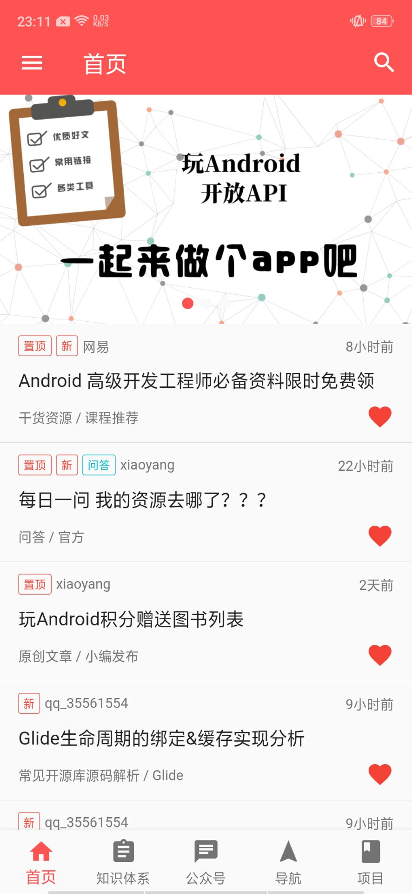 |  | 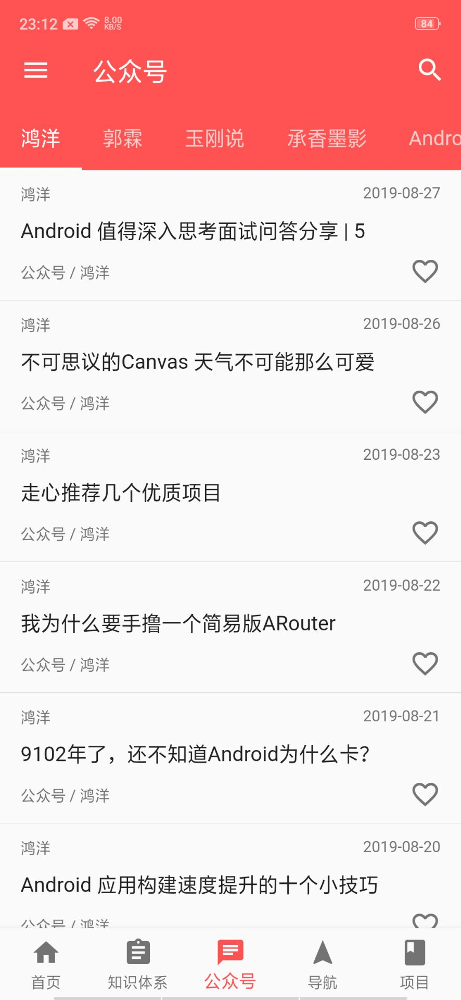 | 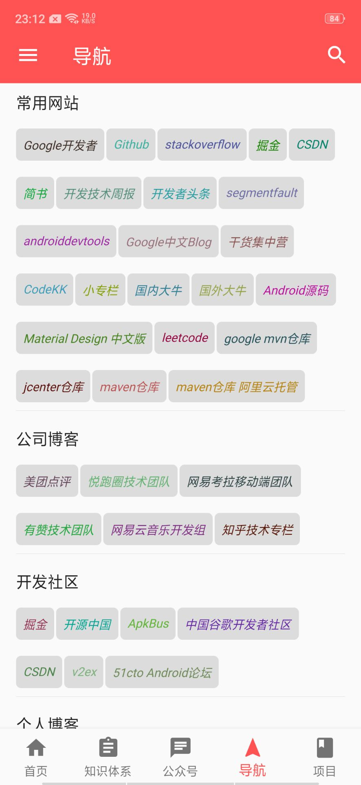 |
| --- | --- | --- | --- |
| 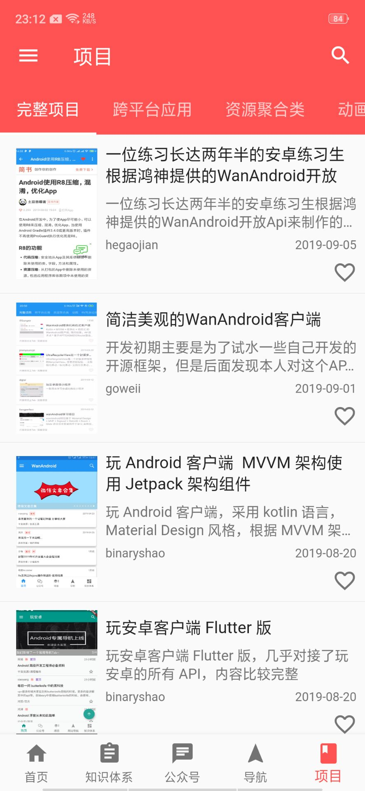 | 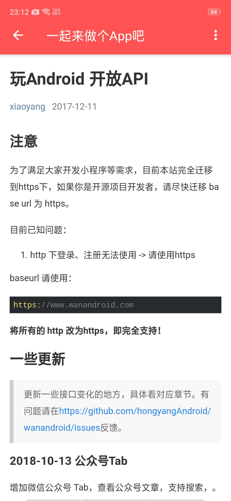 | 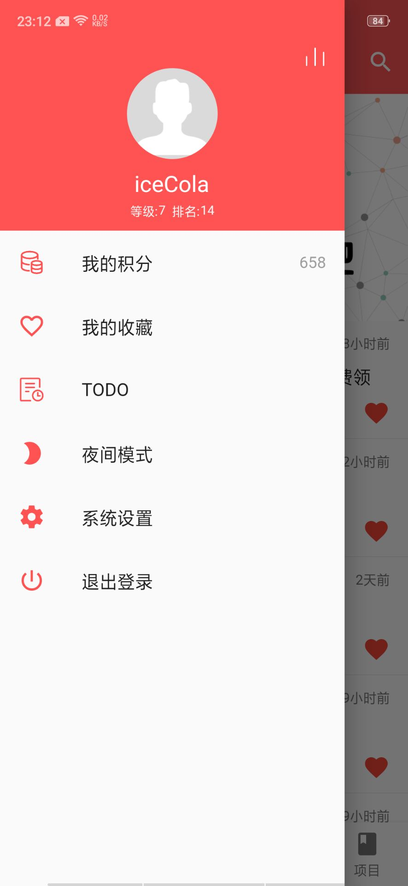 | 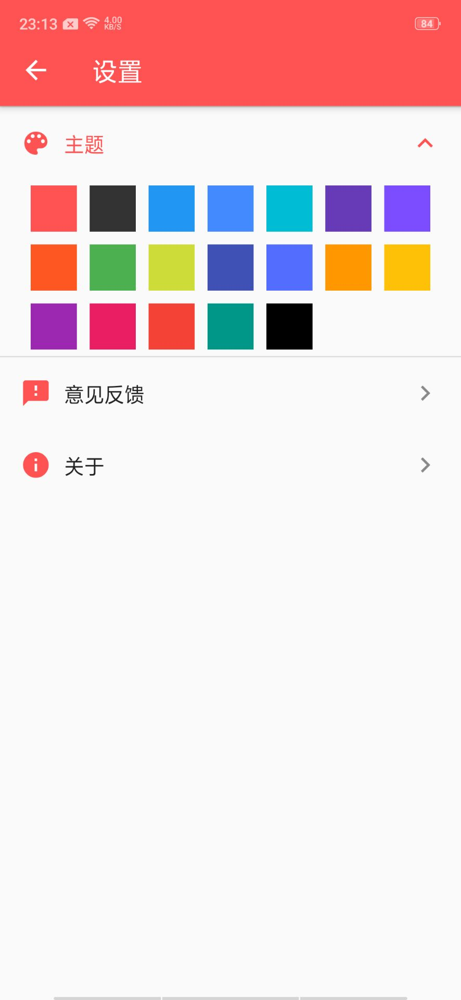 |
|  | 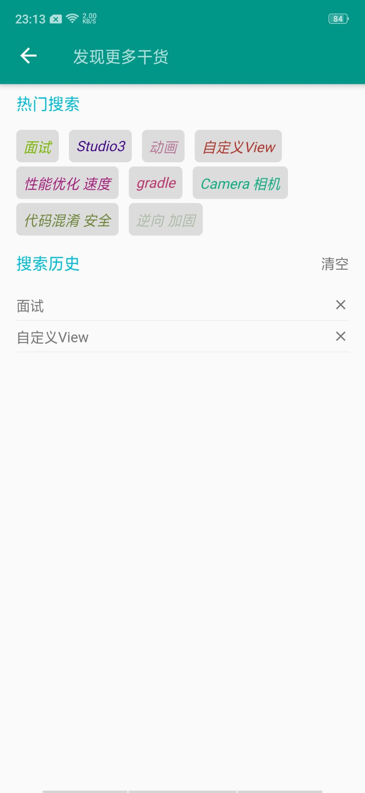 | 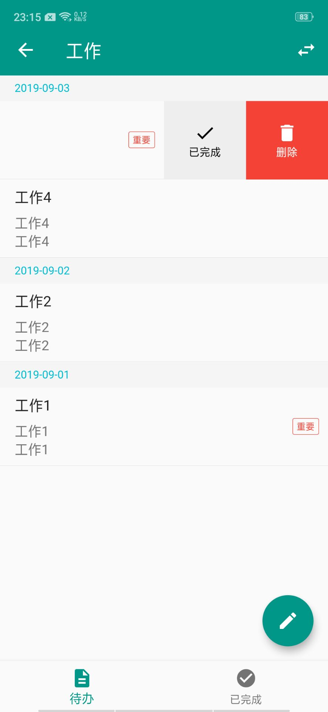 | 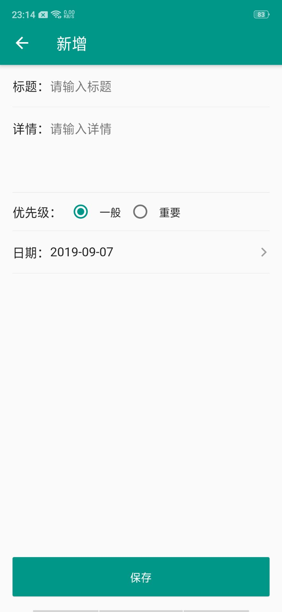 |
| 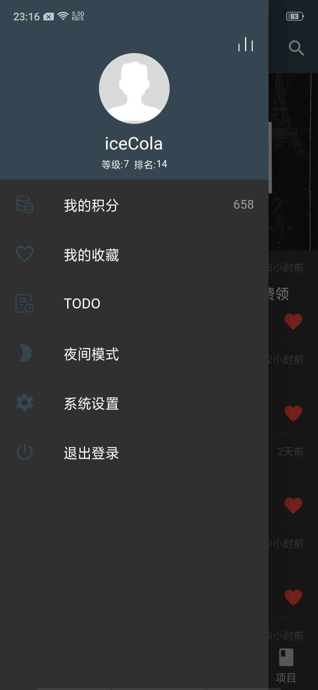 | 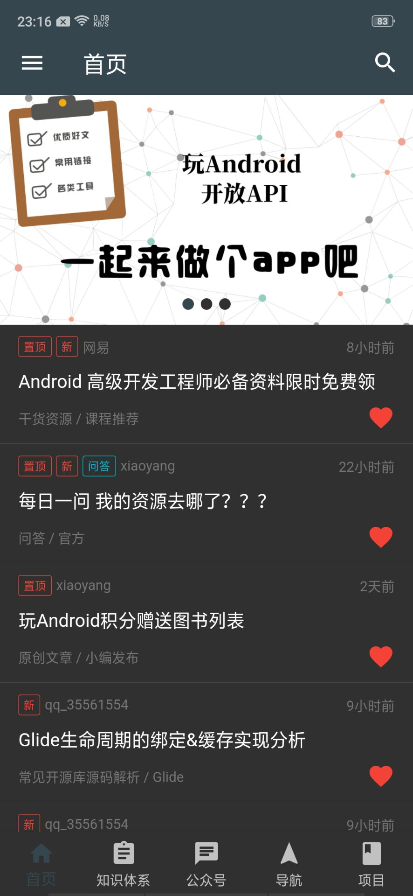 | 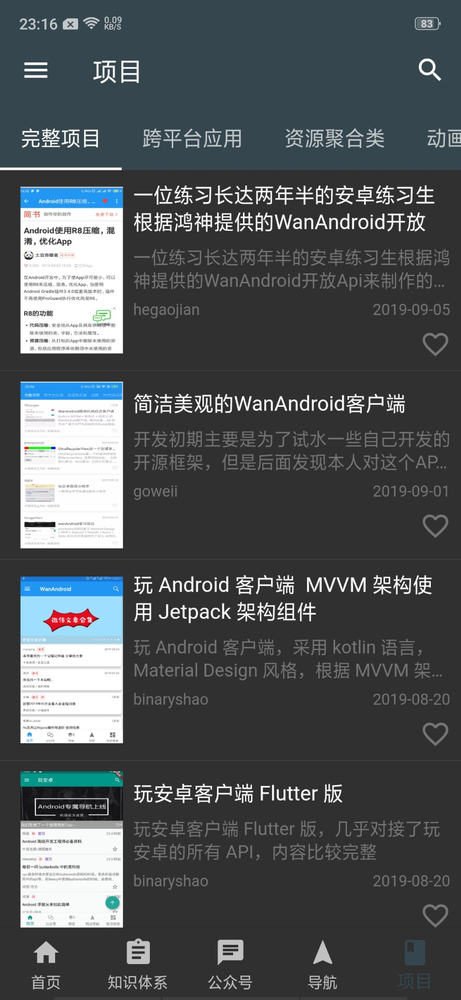 | 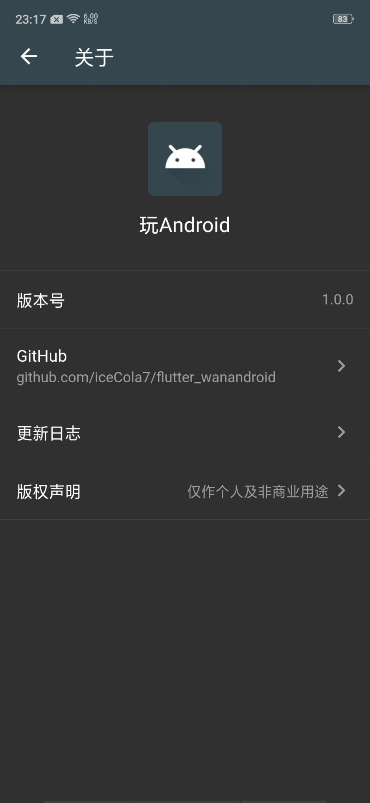 |

## 下载体验

- **Android**
    - 点击[download](https://github.com/iceCola7/flutter_wanandroid/raw/master/android/release/flutter_wanandroid.apk)下载
    - 扫描下方二维码下载(建议使用浏览器扫描下载)
    
        
        
- **iOS**
    - 暂时不支持下载~，可以 `clone` 源码编译运行在 `iOS` 设备上^_^。

## 主要功能

- 首页、知识体系、公众号、导航、项目五大模块；
- 登录注册功能；
- 搜索功能：热门搜索、搜索历史；
- 收藏功能：添加收藏、取消收藏；
- 文章列表快速置顶功能；
- 浏览文章、分享文章、用浏览器打开文章；
- 我的积分、积分排行榜功能；
- TODO模块：新增待办、更新待办、查看待办、删除待办等功能；
- 夜间模式功能；
- 自定义切换主题颜色功能；
- 关于模块。

## 主要开源库

- [dio](https://github.com/flutterchina/dio): 网络库
- [shared_preferences](https://pub.dartlang.org/packages/shared_preferences): 数据存储
- [flutter_swiper](https://github.com/best-flutter/flutter_swiper): 轮播图
- [fluttertoast](https://github.com/PonnamKarthik/FlutterToast): 吐司
- [sqflite](https://pub.flutter-io.cn/packages/sqflite): 数据库
- [event_bus](https://github.com/marcojakob/dart-event-bus): 事件总线
- [cached_network_image](https://github.com/renefloor/flutter_cached_network_image): 图片缓存
- [pull_to_refresh](https://github.com/peng8350/flutter_pulltorefresh): 上拉加载和下拉刷新的组件
- [flutter_slidable](https://github.com/letsar/flutter_slidable): 滑动删除
- [sticky_headers](https://github.com/fluttercommunity/flutter_sticky_headers): 列表悬浮头

## 更新日志

**[最新更新日志请点击查看](https://github.com/iceCola7/flutter_wanandroid/releases)**

**v1.0.3**

- 适配 dio 3.0.3 版本；
- 适配屏幕、文字、图片资源；
- 修改注册完成后自动登录。

**v1.0.2**

- 修改 CookieInterceptor 管理 Cookie 的问题。

**v1.0.1**

- 优化界面，增加官方网站；
- 替换 flutter_webview_plugin；
- 修改 author 为空显示 shareUser ；
- 修改 CookieManager 管理 Cookie 的问题；
- 修改版权声明点击无弹窗问题。

**v1.0.0**

- 首次提交，主要功能都已完成。

## Statement

**项目中的 API 均来自于 [www.wanandroid.com](http://www.wanandroid.com/) 网站，纯属学习交流使用，不得用于商业用途。**

## LICENSE

```
Copyright 2019 iceCola7 

Licensed under the Apache License, Version 2.0 (the "License");
you may not use this file except in compliance with the License.
You may obtain a copy of the License at

   http://www.apache.org/licenses/LICENSE-2.0

Unless required by applicable law or agreed to in writing, software
distributed under the License is distributed on an "AS IS" BASIS,
WITHOUT WARRANTIES OR CONDITIONS OF ANY KIND, either express or implied.
See the License for the specific language governing permissions and
limitations under the License.
```
